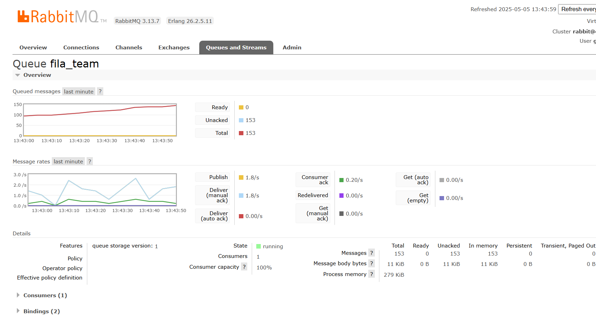

# Relatório de Execução do Sistema RabbitMQ 

## Comandos para Execução do Sistema 

Para iniciar todos os serviços do sistema, foi executado o seguinte comando no terminal: 

```bash 
docker-compose up --build 


Este comando irá:

1. Construir as imagens Docker para todos os serviços (gerador, consumidor_face e consumidor_team) 
2. Iniciar o container do RabbitMQ com a interface de gerenciamento 
3. Iniciar todos os serviços do sistema na ordem correta (esperando o RabbitMQ ficar 
saudável) 

```

## Acesso à Interface de Gerenciamento 

Após a inicialização completa de todos os containers (o que pode levar alguns minutos), é possível acessar a interface web de administração do RabbitMQ em: http://localhost:15672

## Fluxo de Operação Esperado 

1. Inicialização do RabbitMQ: 

    • O container rabbitmq iniciará primeiro 
    • Healthcheck confirmará quando o serviço estiver pronto

2. Inicialização dos Consumidores: 

    • Os serviços consumidor_face e consumidor_team aguardarão o RabbitMQ ficar disponível 
    • Cada um criará sua fila específica e fará o binding com o exchange

3. Inicialização do Gerador:  

    • O serviço gerador começará a produzir mensagens após confirmar que o RabbitMQ está disponível 
    • Mensagens serão enviadas para o exchange 'imagens' com routing keys 'face' ou 'team'

4. Processamento:

    ## Monitoramento da fila team no RabbitMQ

    A imagem abaixo apresenta a interface gráfica de administração do RabbitMQ, acessada via navegador pelo endereço http://localhost:15672. A tela exibida corresponde à fila denominada fila_team, localizada na aba Queues and Streams. Nela é possível observar os seguintes elementos importantes:

    Gráficos de mensagens (Queued messages e Message rates): mostram a evolução da fila ao longo do tempo. No gráfico superior, a linha vermelha representa o total de mensagens acumuladas (153), todas marcadas como Unacked (não confirmadas). Isso indica que o consumidor recebeu essas mensagens, mas ainda não enviou uma confirmação (acknowledgment).

    • Status das mensagens:

        Ready: 0 – não há mensagens prontas para serem consumidas.

        Unacked: 153 – mensagens que foram entregues ao consumidor, mas ainda não foram reconhecidas.

        Total: 153 – total de mensagens presentes na fila.

   • Taxas de mensagens:

        Publish: 1.8 mensagens por segundo estão sendo publicadas na fila.

        Deliver (manual ack): 1.8/s – mensagens entregues ao consumidor com confirmação manual.

        Consumer ack: apenas 0.20/s estão sendo reconhecidas pelo consumidor, o que explica o acúmulo de mensagens não confirmadas.

    • Detalhes da fila:

        State: running – a fila está ativa.

        Consumers: há um único consumidor conectado.

        Consumer capacity: 100% – o consumidor está operando no limite.

        Message body bytes: 11 KiB – representa o tamanho total das mensagens armazenadas.

     


    ## Monitoramento da fila face no RabbitMQ

    A segunda captura de tela refere-se à interface de administração do RabbitMQ, mostrando o estado da fila face. 

    • Mensagens na fila:

        Ready: 0 – nenhuma mensagem está aguardando consumo.

        Unacked: 86 mensagens foram entregues ao consumidor, mas ainda não foram reconhecidas (acknowledged).

        Total: 86 – todas as mensagens entregues ainda estão pendentes de confirmação.

    • Taxas de mensagens:

        Publish: 1.0 msg/s – mensagens estão sendo publicadas regularmente.

        Deliver (manual ack): 1.0 msg/s – entregas estão ocorrendo corretamente.

        Consumer ack: 0.60 msg/s – apenas parte das mensagens entregues está sendo confirmada.

        Redelivered: 0.00 msg/s – nenhuma mensagem foi reenviada (isso indica que ainda não houve timeout ou falha de consumo).

    • Status e capacidade:

        State: running – a fila está ativa.

        Consumers: 1 – há um consumidor conectado à fila.

        Consumer capacity: 100% – o consumidor está operando no máximo da sua capacidade.

        Mensagens armazenadas em memória: 6.3 KiB – todas as mensagens estão na memória, sem persistência em disco.
                
    


## Monitoramento via Interface Web 

Na interface de gerenciamento do Rabbitmq é possivel:

1. Verificar as filas criadas: 
    • fila_face 
    • fila_team 
2. Monitorar: 
    • Mensagens publicadas 
    • Mensagens consumidas 
    • Taxa de transferência 
    • Consumidores ativos 
3. Verificar conexões ativas: 
    • Conexão do gerador 
    • Conexões dos consumidores


OBSERVAÇÃO: as fotos acima não corresponde aos mesmos resultados vistos no video, pois foram tiradas em outro momento em que o comando foi rodado no terminal.


link do video no you tube para assitir toda explicação do trabalho.
     [](https://youtu.be/yPShgjBfKSw)
